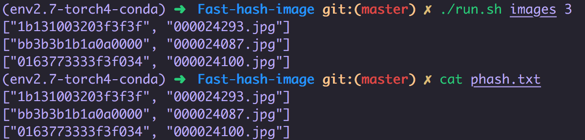

# Fast-hash-image
Fast hash images, run 100% cpu.

## Snapshot


## Install
```bash
pip install requirements.txt
```

## Use
```bash
Format: ./run.sh [images_dir] [num_processes]
./run.sh ./images 10
```